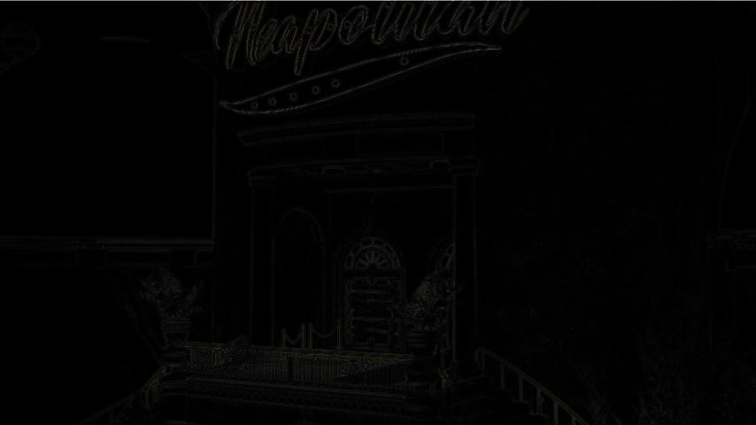

## RTEnhance
RTEnhance 是用于实时图像画面增强的简易API，主要致力于画面边缘强化
## 支持的功能
- 实时图像质量增强
## 效果展示
- 图像对比
<table>
  <tr>
    <th>处理前</th>
    <th>处理后</th>
  </tr>
  <tr>
    <td></td>
    <td></td>
  </tr>
</table>
- 高亮展示
<table>
  <tr>
    <th>Difference</th>
    <th>Highlight</th>
  </tr>
  <tr>
    <td></td>
    <td></td>
  </tr>
</table>

## 使用
1. 加载文件
    - 拷贝SDK目录(Web/Enhance/js/sdk/)下的文件到你的项目中
    ```shell
    copy "Web/Enhance/js/sdk/*.*" "YourProjectDirectory"
    ```
    - 链接JS文件, 先加载OpenCV.js
    ```html
    <!-- other code -->
    <script src="YourProjectDirectory/opencv.js"></script>
    <script src="YourProjectDirectory/image_process.js"></script>
    <!-- other code -->
    ```
2. 使用示例：
    - 增强一张图片并渲染到Canvas上
    ```js
    let img_elm = document.getElementsByTagName("image")[0];
    let canvas_elm = document.getElementsByTagName("canvas")[0];
    //创建一个增强的程序 ImageEnhanceFrist 是最快速增强，增强效果相对比较弱
    let enhance_app = new ImageEnhanceFrist();
    // new ImageEnhanceDetails(); //更多细节的增强方式，速度较慢，但是会让图像细节更饱满，并且包含亮度重调整
    // new ImageEnhance(); //

    let src_img = cv.imread(img_elm);
    cv.cvtColor(src_img,src_img,cv.COLOR_RGBA2RGB);
    let dst_img = new cv.Mat();
    
    enhance_app.process(src_img,dst_img);
    cv.imshow(canvas_elm,dst_img);

    //使用完毕记得释放资源
    dst_img.delete();
    src_img.delete();
    enhance_app.delete();
    ```
    - 完整的示例可以查看Enhance/index.html